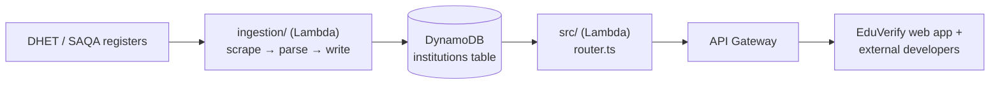
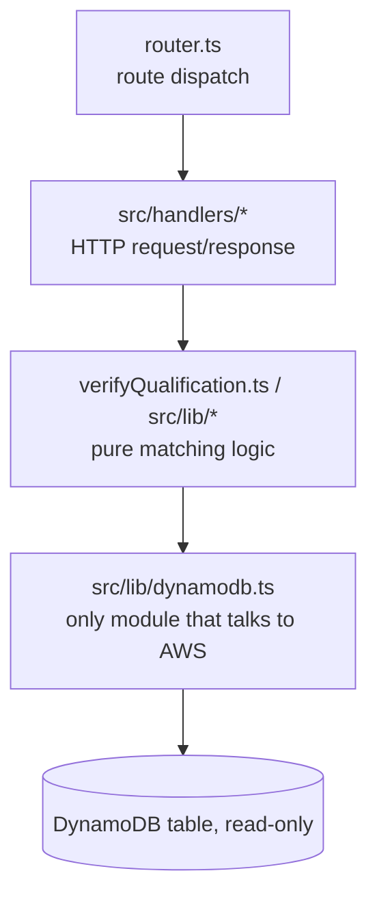
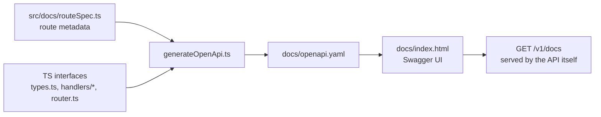

# eduverify-api

Verification API for South African institutions and qualifications. Performs an ingest
(`ingestion/`) → parse → write → serve (`src/`) end to end.



- `src/handlers/` : institutions, qualifications, verify, health.
- `src/matching/verifyQualification.ts` : the fuzzy qualification matcher
- `src/tiers.ts`/ `src/keyTiers.ts` : tier gating
- `src/router.ts` : the single Lambda internal router behind API Gateway's proxy integration

These are all implemented and unit tested against mocked DynamoDB calls — see `src/router.ts`'s route
table for the full `/v1/*` surface. All tests mock `../lib/dynamodb`'s exported functions rather
than running against DynamoDB Local.



`ingestion/` (Python) — the DHET register scraper - is deployed as a container image Lambda (`ingestion/Dockerfile`),
provisioned by `terraform/ingestion/`.

## Commands

```bash
npm install
npm run test          # vitest
npm run typecheck     # tsc --noEmit
npm run docs:generate # regenerate docs/openapi.yaml from src/docs/routeSpec.ts + TS types
npm run docs          # serve Swagger UI at http://localhost:4000
```

## Local development (DynamoDB Local + curl/Postman)

The full `/v1/*` surface can be exercised locally against [DynamoDB Local](https://hub.docker.com/r/amazon/dynamodb-local),
seeded from the (gitignored, local only) `data/*.json` fixtures, the DHET private register plus
public university/TVET lists, in the same shape `parser/dynamo_item.py` bakes into the real
table.

```bash
npm run dynamodb:local   # terminal 1 — docker run amazon/dynamodb-local on :8000
npm run seed:local       # terminal 2 — creates the table (if needed) and loads data/*.json
npm run dev              # terminal 2 — dev server on :3000, proxying to router.ts
```

Then hit any route directly, e.g.:

```bash
curl http://localhost:3000/v1/health
curl http://localhost:3000/v1/stats
curl "http://localhost:3000/v1/institutions/search?q=cape+town"
curl "http://localhost:3000/v1/institutions/list?page=1&pageSize=25"
curl -X POST http://localhost:3000/v1/institutions/verify \
  -H "Content-Type: application/json" \
  -d '{"registrationNumber": "2000/HE07/015"}'
```

Same in Postman: point requests at `http://localhost:3000/v1/...` — `x-api-key` is read from the
request header exactly like the deployed API Gateway route would (see `src/tiers.ts`).

- `scripts/dev-server.ts` is a plain Node HTTP server standing in for API Gateway's proxy
  integration — it translates a raw request into the same event shape `router.ts` is already
  unit-tested against, and nothing else. `PORT` (default `3000`) overrides the port.
- `scripts/seed-local-dynamodb.ts` creates the table/GSI1 if missing and batch-writes every
  fixture as an item shaped the way `src/lib/dynamodb.ts`'s `toRecord()` expects to read it back
  (public university/TVET entries get a synthesized `contacts`/`institutionType`, matching what
  eduverify's own `scripts/seed_dynamodb.py` does against the real table).
- Both scripts (and `src/lib/dynamodb.ts` itself) read `DYNAMODB_ENDPOINT` — set only for local
  dev, never in a deployed environment — to point the AWS SDK at DynamoDB Local with a fixed
  dummy credential pair instead of the real AWS endpoint/credentials.

## API docs



`docs/openapi.yaml` is a **generated** OpenAPI 3 spec for the full `/v1/*` surface — don't hand-
edit it. `src/docs/routeSpec.ts` is the source of truth for route metadata (method, path,
summary, query params, auth); request/response *schemas* are generated straight from the actual
exported TS interfaces (`src/lib/types.ts`, `src/handlers/*.ts`,
`src/matching/verifyQualification.ts`, `src/router.ts`'s `ErrorResponse`) via
`src/docs/generateOpenApi.ts` (built on `ts-json-schema-generator`), so the spec can't drift the
way a hand-written one silently did before. Run `npm run docs:generate` after changing a route in
`routeSpec.ts` or a referenced type — `src/docs/generateOpenApi.test.ts` fails with a pointer to
that command if the checked-in file falls out of sync. `docs/index.html` is a Swagger UI page
that renders the spec, with "Try it out" enabled for every endpoint.

The API serves this same page itself at `GET /v1/docs` (spec at `GET /v1/openapi.yaml`) — so
"Try it out" works against whatever's actually running the API, regardless of environment: point
your browser at `http://localhost:3000/v1/docs` while `npm run dev` is up, or at the real
`invoke_url` once deployed, with no separate process to remember to start. `npm run docs` (a
plain static file server at http://localhost:4000) still works too, e.g. for viewing the spec
before any API instance is running at all — a `file://` page can't `fetch` its sibling
`openapi.yaml` directly, which is what that script's server is for.

The spec's `servers` block already points at the real deployed API Gateway host (the `apiId`
from `terraform output invoke_url`, filled in in `generateOpenApi.ts` once `terraform apply` was
run), with `stage` selectable between `staging` and `production` — so "Try it out" hits the real
deployment directly, not just `npm run dev`. If the API is ever redeployed to a new API Gateway
(new `apiId`), update that hardcoded host in `generateOpenApi.ts` and regenerate.

## Why fork instead of share a package

The lifted modules (`search.ts`, `normalize.ts`, `qualificationSearch.ts`, `presentation.ts`,
`facultiesAndProgrammes.ts`, `qualificationsMatching.ts`, `keys.ts`, `dynamodb.ts`, `types.ts`)
are small and independently unit-tested; a shared `@eduverify/core` npm package is a reasonable
future step if drift between the two copies becomes a real recurring cost, but isn't worth the
publish-pipeline overhead yet. `keys.ts` in particular mirrors `parser/dynamo_item.py` (Python)
and `web/lib/keys.ts` (TS) in the `eduverify` repo — if the slugify algorithm changes, all three
must change together, or lookups by id will miss rows in the shared table. `keys.test.ts` pins
known slugs against real institution names as the only automated guard against that drift.

## Adaptations from the original `web/lib` modules

- `search.ts`'s `searchLocal(query, filters, limit)` (which read a bundled local JSON seed)
  became `searchInstitutions(institutions, query, filters, limit)` — a pure ranking function
  over a caller-supplied candidate list, since this repo has no bundled seed; callers in
  `src/handlers/` supply candidates fetched from DynamoDB.
- `types.ts`'s `SaqaQualification` gained a required `framework` field (HEQSF/OQSF/GFETQSF/
  SFAP/SFNA) — see the corresponding parser change in `eduverify`.
